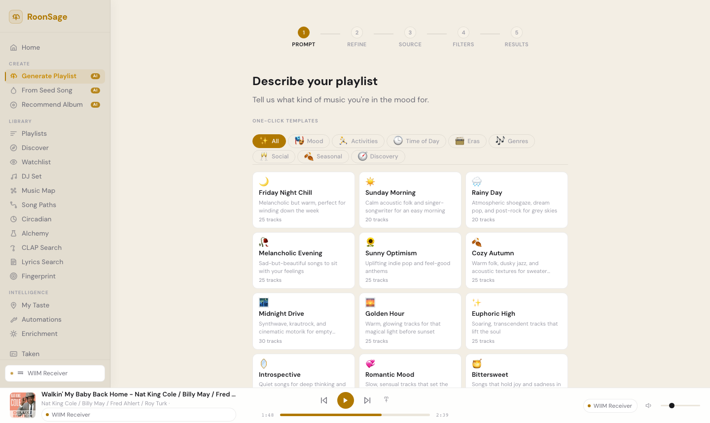
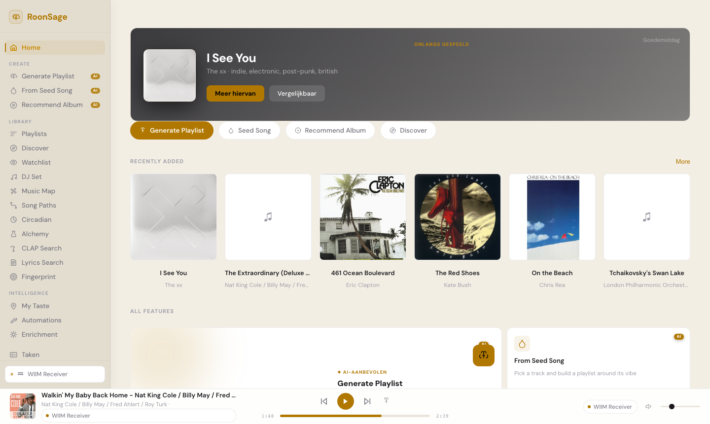

# MediaSage for Roon

[](https://opensource.org/licenses/MIT)
[](https://hub.docker.com/r/ecwilson/mediasage)
[](https://ghcr.io/ecwilsonaz/mediasage)
[](https://www.python.org/downloads/)

**AI-powered playlists and album recommendations for Roon—using only music you actually own.**

MediaSage is a self-hosted web app that creates playlists and recommends albums by combining LLM intelligence with your Roon library. Every suggestion is guaranteed playable because it only considers music you have.

*Sample Generated Playlist:*


*Sample Generated Album Recommendation:*


*Home Screen:*


*Playlist Flow:*


*Album Flow:*


---

## Quick Start

```bash
docker run -d \
  --name mediasage \
  -p 5765:5765 \
  -v mediasage-data:/app/data \
  --restart unless-stopped \
  -e ROON_HOST=192.168.1.x \
  ghcr.io/ecwilsonaz/mediasage:latest
```

Open **http://localhost:5765** — a setup wizard walks you through connecting to your Roon Core, choosing an AI provider, and syncing your library.

You can also pass credentials as environment variables to skip the wizard. See [Configuration](#configuration) for details.

**Requirements:** Docker, a running Roon Core, and an API key from Google, Anthropic, or OpenAI (or a local model via Ollama).

---

## Contents

- [Why MediaSage?](#why-mediasage)
- [Features](#features)
- [Installation](#installation)
- [Configuration](#configuration)
- [Roon Authorization](#roon-authorization)
- [How It Works](#how-it-works)
- [Development](#development)
- [API Reference](#api-reference)

---

## Why MediaSage?

**Roon users with large personal libraries have few good options for AI-powered playlist generation.**

Generic tools like ChatGPT recommend from an infinite catalog with no awareness of what you actually own. The result: playlists full of tracks you don't have.

**MediaSage inverts the approach:**

| Filter-Last (ChatGPT, generic AI) | Filter-First (MediaSage) |
|-----------------------------------|-------------------------|
| AI recommends from infinite catalog | AI only sees your library |
| Missing tracks after filtering | No missing tracks possible |
| Near-empty playlists | Full playlists, every time |

Every track in every playlist exists in your Roon library and plays immediately.

---

## Features

### Playlist Generation

Create playlists two ways:

**Describe what you want** — Natural language prompts like:
- "Melancholy 90s alternative for a rainy day"
- "Upbeat instrumental jazz for a dinner party"
- "Late night electronic, nothing too aggressive"

**Start from a song** — Pick a track you love, then explore musical dimensions: mood, era, instrumentation, genre, production style. Select which qualities you want more of.

### Album Recommendations

Describe a mood or moment, answer two quick questions about your preferences, and get a single perfect album to listen to—with an editorial pitch explaining why it fits.

- **Library mode** — recommends albums you own, ready for instant playback
- **Discovery mode** — suggests albums you don't own yet, based on your taste profile
- **Familiarity control** — choose between comfort picks, hidden gems, or rediscoveries
- **Show Me Another** — regenerate without starting over
- Primary recommendation with a full write-up, plus two secondary picks

### Smart Filtering

Before the AI sees anything, you control the pool:
- **Genres** — Select from your library's actual genre tags
- **Decades** — Filter by era
- **Minimum rating** — Only tracks rated 3+, 4+, etc.
- **Exclude live versions** — Skip concert recordings automatically

Real-time track counts show exactly how your filters narrow results.

### Local Library Cache

MediaSage syncs your Roon library to a local SQLite database. After a one-time sync, all library operations—filtering, counting, sending to AI—happen locally in milliseconds.

- **Setup wizard** walks you through first-run configuration and sync
- **Footer status** shows track count and last sync time
- **Auto-refresh** keeps cache current (syncs if >24h stale)
- **Manual refresh** available anytime

### Multi-Provider Support

Bring your own API key—or run locally:

| Provider | Max Tracks | Typical Cost | Best For |
|----------|------------|--------------|----------|
| **Google Gemini** | ~18,000 | $0.03 – $0.25 | Large libraries, lowest cost |
| **Anthropic Claude** | ~3,500 | $0.15 – $0.25 | Nuanced recommendations |
| **OpenAI GPT** | ~2,300 | $0.05 – $0.10 | Solid all-around |
| **Ollama** ⚗️ | Varies | Free | Privacy, local inference |
| **Custom** ⚗️ | Configurable | Free | Self-hosted, OpenAI-compatible APIs |

⚗️ *Local LLM support is experimental. [Report issues](https://github.com/Georgemvp/roon-mediasage/issues).*

> **Free option:** Google Gemini offers a free API tier that's more than enough for personal use — no credit card required. See the [Gemini free credit guide](docs/gemini-free-credit-guide.md) for setup instructions and details.

Estimated cost displays before you generate. MediaSage auto-detects your provider based on which key you configure.

### Play and Queue

- **Play Now** — send tracks directly to any Roon zone for instant playback
- **Queue** — append tracks to the current Roon zone queue
- Zone picker shows all active Roon zones
- Preview tracks with album art before sending
- Remove tracks you don't want
- See actual token usage and cost

---

## Installation

### Docker Compose (Recommended)

```bash
mkdir mediasage && cd mediasage
curl -O https://raw.githubusercontent.com/Georgemvp/roon-mediasage/main/docker-compose.yml
```

Edit `docker-compose.yml` or create a `.env` file:

```bash
ROON_HOST=192.168.1.x
ROON_PORT=9330

# Choose ONE provider:
GEMINI_API_KEY=your-gemini-key
# ANTHROPIC_API_KEY=sk-ant-your-key
# OPENAI_API_KEY=sk-your-key
```

Start:

```bash
docker compose up -d
```

Then **authorize MediaSage in Roon** — see [Roon Authorization](#roon-authorization).

### NAS Platforms

<details>
<summary><strong>Synology (Container Manager)</strong></summary>

**GUI:**
1. **Container Manager** → **Registry** → Search `ghcr.io/ecwilsonaz/mediasage`
2. Download `latest` tag
3. **Container** → **Create**
4. Port: 5765 → 5765
5. Add environment variables: `ROON_HOST`, `GEMINI_API_KEY`

**Docker Compose:**
```bash
mkdir -p /volume1/docker/mediasage && cd /volume1/docker/mediasage
curl -O https://raw.githubusercontent.com/Georgemvp/roon-mediasage/main/docker-compose.yml
nano docker-compose.yml  # set ROON_HOST and API key
```
Then in **Container Manager** → **Project** → **Create**, point to `/volume1/docker/mediasage`.

**No Docker?** Some Synology models (especially ARM-based units) don't support Docker/Container Manager. See [Bare Metal](#bare-metal-no-docker) below.

</details>

<details>
<summary><strong>Unraid</strong></summary>

1. **Docker** → **Add Container**
2. Repository: `ghcr.io/ecwilsonaz/mediasage:latest`
3. Port: 5765 → 5765
4. Add variables: `ROON_HOST`, `GEMINI_API_KEY`

</details>

<details>
<summary><strong>TrueNAS SCALE</strong></summary>

1. **Apps** → **Discover Apps** → **Custom App**
2. Image: `ghcr.io/ecwilsonaz/mediasage`, Tag: `latest`
3. Port: 5765
4. Add environment variables

</details>

<details>
<summary><strong>Portainer</strong></summary>

**Stacks** → **Add Stack**:

```yaml
services:
  mediasage:
    image: ghcr.io/ecwilsonaz/mediasage:latest
    ports:
      - "5765:5765"
    environment:
      - ROON_HOST=192.168.1.x
      - ROON_PORT=9330
      - GEMINI_API_KEY=your-key
    volumes:
      - ./data:/app/data
    restart: unless-stopped
```

</details>

### Bare Metal (No Docker)

MediaSage is Python + FastAPI with no native dependencies, so it runs on any machine with Python 3.11+.

```bash
git clone https://github.com/Georgemvp/roon-mediasage.git
cd roon-mediasage
python -m venv venv
source venv/bin/activate
pip install -r requirements.txt
```

Set your environment variables:

```bash
export ROON_HOST=192.168.1.x
export ROON_PORT=9330
export GEMINI_API_KEY=your-gemini-key
```

Start the server:

```bash
uvicorn backend.main:app --host 0.0.0.0 --port 5765
```

Access at **http://your-machine-ip:5765**.

<details>
<summary><strong>Running as a background service (systemd)</strong></summary>

```ini
# /etc/systemd/system/mediasage.service
[Unit]
Description=MediaSage
After=network.target

[Service]
Type=simple
User=your-user
WorkingDirectory=/path/to/roon-mediasage
EnvironmentFile=/path/to/roon-mediasage/.env
ExecStart=/path/to/roon-mediasage/venv/bin/uvicorn backend.main:app --host 0.0.0.0 --port 5765
Restart=on-failure

[Install]
WantedBy=multi-user.target
```

```bash
sudo systemctl enable mediasage
sudo systemctl start mediasage
```

</details>

---

## Configuration

### Environment Variables

| Variable | Required | Description |
|----------|----------|-------------|
| `ROON_HOST` | Yes | IP address or hostname of your Roon Core |
| `ROON_PORT` | No | Roon Core port (default: `9330`) |
| `ROON_CORE_ID` | No | Auto-saved after first authorization |
| `ROON_TOKEN` | No | Auto-saved after first authorization |
| `GEMINI_API_KEY` | One required | Google Gemini API key |
| `ANTHROPIC_API_KEY` | One required | Anthropic API key |
| `OPENAI_API_KEY` | One required | OpenAI API key |
| `LLM_PROVIDER` | No | Force provider: `gemini`, `anthropic`, `openai`, `ollama`, `custom` |
| `OLLAMA_URL` | No | Ollama server URL (default: `http://localhost:11434`) |
| `OLLAMA_CONTEXT_WINDOW` | No | Override detected context window for Ollama (default: 32768) |
| `CUSTOM_LLM_URL` | No | Custom OpenAI-compatible API base URL |
| `CUSTOM_LLM_API_KEY` | No | API key for custom provider (if required) |
| `CUSTOM_CONTEXT_WINDOW` | No | Context window size for custom provider (default: 32768) |

### Web UI Configuration

You can also configure MediaSage through the **Settings** page in the web UI. Settings entered there are saved to `config.user.yaml` and persist across restarts. Environment variables always take priority over UI-saved settings.

### Advanced: config.yaml

Mount a config file for additional options (see `config.example.yaml`):

```yaml
roon:
  host: "192.168.1.x"
  port: 9330
  # core_id and token are auto-saved after authorization
  core_id: ""
  token: ""

llm:
  provider: "gemini"
  model_analysis: "gemini-2.5-flash"
  model_generation: "gemini-2.5-flash"
  smart_generation: false  # true = use smarter model for both (higher quality, ~3-5x cost)

defaults:
  track_count: 25
```

### Model Selection

MediaSage uses a two-model strategy by default:

| Role | Purpose | Models Used |
|------|---------|-------------|
| **Analysis** | Interpret prompts, suggest filters, analyze seed tracks | claude-sonnet-4-5 / gpt-4.1 / gemini-2.5-flash |
| **Generation** | Select tracks from filtered list | claude-haiku-4-5 / gpt-4.1-mini / gemini-2.5-flash |

This balances quality with cost. Enable `smart_generation: true` to use the analysis model for everything.

### Local LLM Setup (Experimental)

<details>
<summary><strong>Ollama</strong></summary>

1. Install [Ollama](https://ollama.ai) and pull a model:
   ```bash
   ollama pull llama3:8b
   ```

2. Configure MediaSage:
   ```bash
   LLM_PROVIDER=ollama
   OLLAMA_URL=http://localhost:11434
   ```

3. Select your model in Settings — the context window is auto-detected.

**Recommended models:** `llama3:8b`, `qwen3:8b`, `mistral` — models with 8K+ context work best.

</details>

<details>
<summary><strong>Custom OpenAI-Compatible API</strong></summary>

For LM Studio, text-generation-webui, vLLM, or any OpenAI-compatible server:

1. Start your server with an OpenAI-compatible endpoint

2. Configure in Settings:
   - **API Base URL:** `http://localhost:5000/v1`
   - **API Key:** If required by your server
   - **Model Name:** The model identifier
   - **Context Window:** Your model's context size

</details>

### Claude Desktop (MCP)

Use Claude Desktop as a natural-language interface for MediaSage via [MCP](https://modelcontextprotocol.io) (Model Context Protocol). Instead of using the web UI, you can just tell Claude what you want and it will search your library, build a playlist, and send it to Roon — all in a single conversation.

**How it works:** Claude Desktop talks to `mcp_server.py` over stdio. The MCP server calls the MediaSage REST API, which handles library lookups and Roon playback. Claude does the thinking (interpreting your prompt, choosing tracks); MediaSage supplies the library data and Roon connection. No extra API key is needed — your Claude Pro or Claude Team subscription covers it.

**Setup:**

1. Install the MCP package:
   ```bash
   pip install "mcp[cli]"
   ```

2. Make sure MediaSage is running on `http://localhost:5765`.

3. Add the MCP server to your Claude Desktop config at  
   `~/Library/Application Support/Claude/claude_desktop_config.json`:
   ```json
   {
     "mcpServers": {
       "roon-mediasage": {
         "command": "python",
         "args": ["/FULL/PATH/TO/roon-mediasage/mcp_server.py"]
       }
     }
   }
   ```
   Replace `/FULL/PATH/TO/roon-mediasage` with the absolute path to the repo on your machine.

4. Restart Claude Desktop.

**Optional:** If MediaSage runs on a different host or port, set the `MEDIASAGE_URL` environment variable:
```json
{
  "mcpServers": {
    "roon-mediasage": {
      "command": "python",
      "args": ["/FULL/PATH/TO/roon-mediasage/mcp_server.py"],
      "env": {
        "MEDIASAGE_URL": "http://192.168.1.x:5765"
      }
    }
  }
}
```

**Example prompts in Claude Desktop:**

- *"Wat voor jazz heb ik in mijn library?"*
- *"Maak een playlist met rustige elektronische muziek uit de jaren 90 en speel het af in de woonkamer."*
- *"Zoek alles van Radiohead en voeg het toe aan de queue."*

---

## Roon Authorization

MediaSage connects to Roon as an **Extension**. After starting the app for the first time:

1. Open **Roon** on any device
2. Go to **Settings → Extensions**
3. Find **MediaSage** in the list and click **Enable**
4. MediaSage is now authorized and will save the token automatically

Make sure MediaSage is reachable on the same network as your Roon Core, and that `ROON_HOST` points to the machine running Roon Core. The `ROON_CORE_ID` and `ROON_TOKEN` are saved automatically to `data/config.user.yaml` after the first successful authorization.

---

## How It Works

MediaSage uses a **filter-first architecture** designed for large libraries (50,000+ tracks):

```
┌─────────────────────────────────────────────────────────────────┐
│  1. ANALYZE                                                      │
│     LLM interprets your prompt → suggests genre/decade filters   │
├─────────────────────────────────────────────────────────────────┤
│  2. FILTER                                                       │
│     Roon library narrowed to matching tracks                     │
│     "90s Alternative" → 2,000 tracks                             │
├─────────────────────────────────────────────────────────────────┤
│  3. SAMPLE                                                       │
│     If too large for context, randomly sample                    │
│     Fits within model's token limits                             │
├─────────────────────────────────────────────────────────────────┤
│  4. GENERATE                                                     │
│     Filtered track list + prompt sent to LLM                     │
│     LLM selects best matches from available tracks               │
├─────────────────────────────────────────────────────────────────┤
│  5. MATCH                                                        │
│     Fuzzy matching links LLM selections to library               │
│     Handles minor spelling/formatting differences                │
├─────────────────────────────────────────────────────────────────┤
│  6. PLAY                                                         │
│     Tracks sent to a Roon zone                                   │
│     Ready for immediate playback in any Roon client              │
└─────────────────────────────────────────────────────────────────┘
```

This ensures every track exists in your library while keeping API costs manageable.

---

## Development

### Local Setup

```bash
git clone https://github.com/Georgemvp/roon-mediasage.git
cd roon-mediasage
python -m venv venv
source venv/bin/activate
pip install -r requirements.txt

export ROON_HOST=192.168.1.x
export ROON_PORT=9330
export GEMINI_API_KEY=your-key

uvicorn backend.main:app --reload --port 5765
```

### Testing

```bash
pytest tests/ -v
```

### Tech Stack

- **Backend:** Python 3.14+, FastAPI, roonapi, rapidfuzz, httpx
- **Frontend:** Vanilla HTML/CSS/JS (no build step)
- **LLM SDKs:** anthropic, openai, google-genai (+ Ollama via REST API)
- **Deployment:** Docker

---

## API Reference

Interactive documentation available at `/docs` when running.

| Endpoint | Method | Description |
|----------|--------|-------------|
| `/api/health` | GET | Health check |
| `/api/config` | GET/POST | Get or update configuration |
| `/api/setup/status` | GET | Onboarding checklist state |
| `/api/setup/validate-roon` | POST | Validate Roon Core connection |
| `/api/setup/validate-ai` | POST | Validate AI provider credentials |
| `/api/setup/complete` | POST | Mark setup wizard as complete |
| `/api/library/stats` | GET | Library statistics |
| `/api/library/stats/cached` | GET | Cached library statistics |
| `/api/library/status` | GET | Cache state, track count, sync progress |
| `/api/library/sync` | POST | Trigger background library sync |
| `/api/library/search` | GET | Search library tracks |
| `/api/analyze/prompt` | POST | Analyze natural language prompt |
| `/api/analyze/track` | POST | Analyze a seed track |
| `/api/filter/preview` | POST | Preview filtered track list |
| `/api/generate/stream` | POST | Stream playlist generation (SSE) |
| `/api/roon/zones` | GET | List active Roon zones |
| `/api/queue` | POST | Send tracks to a Roon zone |
| `/api/queue/append` | POST | Append tracks to a Roon zone queue |
| `/api/recommend/albums/preview` | GET | Preview album candidates for filters |
| `/api/recommend/analyze-prompt` | POST | Analyze prompt for genre/decade filters |
| `/api/recommend/questions` | POST | Generate clarifying questions |
| `/api/recommend/generate` | POST | Generate album recommendations |
| `/api/recommend/switch-mode` | POST | Switch library/discovery mode |
| `/api/results` | GET | List saved result history |
| `/api/results/{id}` | GET/DELETE | Get or delete a saved result |
| `/api/art/{item_key}` | GET | Proxy album art from Roon |
| `/api/external-art` | GET | Fetch external album art |
| `/api/ollama/status` | GET | Ollama connection status |
| `/api/ollama/models` | GET | List available Ollama models |
| `/api/ollama/model-info` | GET | Get model details (context window) |

---

## License

MIT
