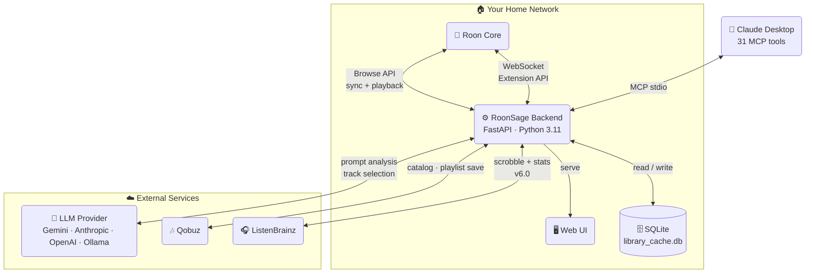
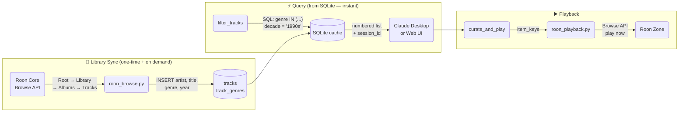
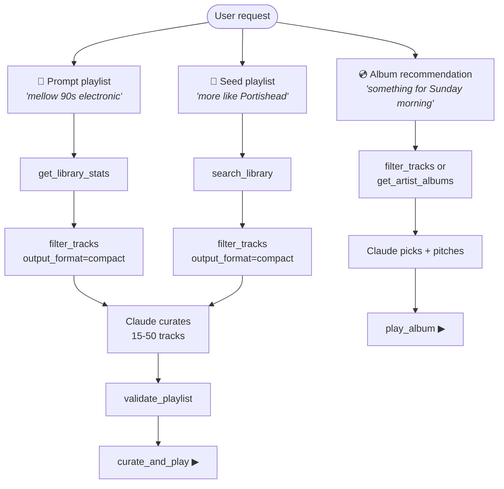
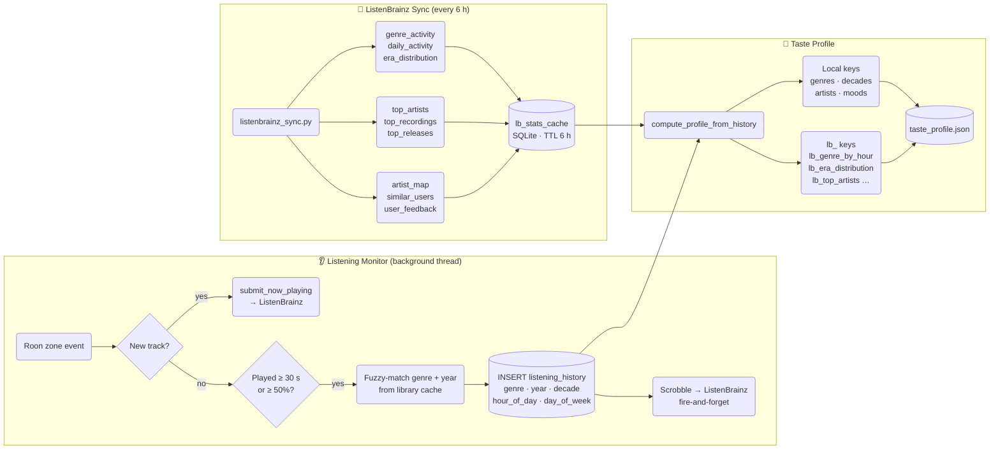
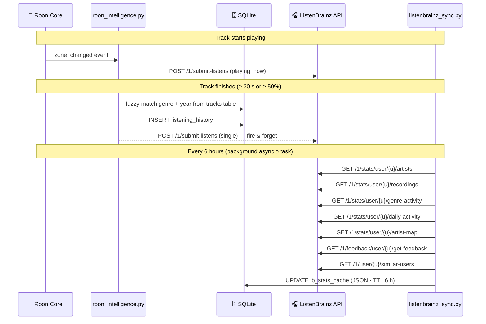

<div align="center">

# 🎵 RoonSage

**AI-powered playlist curation and music intelligence for Roon**

[](https://opensource.org/licenses/MIT)
[](https://www.python.org/downloads/)
[](https://fastapi.tiangolo.com)
[](#changelog)
[](https://listenbrainz.org)

_Curate playlists from your own library, discover new music on Qobuz,_
_and let Claude Desktop control every aspect of Roon — all in natural language._

[Features](#features) · [Claude Desktop](#claude-desktop-integration) · [ListenBrainz](#listenbrainz-integration-v60) · [Setup](#deployment) · [API](#api-reference) · [Changelog](#changelog)

</div>

---

## Screenshots

| Playlist generation | Album recommendation |
|---|---|
|  |  |

---

## What is RoonSage?

RoonSage is a **self-hosted web app** that connects to your Roon Core as an Extension. It syncs your library to a local SQLite cache and wraps everything in a full **MCP server** so Claude Desktop can search, curate, and control Roon through natural conversation.

Key design principles:

- **Library-first** — 100% of suggested tracks exist in your library or on Qobuz; nothing is hallucinated
- **Claude curates** — Claude Desktop does the musical thinking; the backend provides data and Roon connectivity
- **No build step** — vanilla HTML/CSS/JS frontend, single Docker container
- **Optional everything** — Qobuz, ListenBrainz, and password auth are all optional add-ons

---

## System Architecture



---

## How Data Flows



---

## Claude Desktop Integration

> This is the **primary** way to use RoonSage. Claude curates everything — no extra API key, no per-token cost for curation.

```
"Maak een playlist voor een late vrijdagavond, iets melancholisch maar niet depressief."
"More like what's playing now, but a bit more energetic."
"Find a jazz album I don't know yet and play it."
"Give me everything by Nick Cave that I own."
"Set volume to 40% and turn on shuffle."
"Group the living room and kitchen zones."
"Save this playlist to Qobuz so I can listen on the go in Arc."
"What does my taste profile say about my listening habits?"
"Sync my ListenBrainz stats and show me my genre heatmap."
```

### Three curation flows



### Three source modes

| Mode | When to use | Claude's approach |
|---|---|---|
| **Library** | "from my collection" | `filter_tracks` → curate → `curate_and_play` |
| **Hybrid** | "mix mine with discoveries" | `filter_tracks` + `search_qobuz` → blend → `play_tracks` |
| **Qobuz** | "something new", "surprise me" | multiple `search_qobuz` → curate → `play_tracks` |

### Full MCP tool list

<details>
<summary><strong>Library & search</strong></summary>

| Tool | Description |
|---|---|
| `get_library_stats` | Genre / decade / total counts from SQLite |
| `get_library_status` | Cache freshness, needs_resync flag |
| `search_library` | Search by track / artist / album |
| `search_qobuz` | Search Qobuz catalogue via Roon |
| `filter_tracks` | Filter by genre, decade, live exclusion; `output_format` = json / compact / ultra |
| `get_artist_albums` | All albums by an artist from cache |
| `sync_library` | Trigger background library sync |

</details>

<details>
<summary><strong>Playlist generation (web UI / fallback)</strong></summary>

| Tool | Description |
|---|---|
| `generate_playlist` | AI playlist from natural language (SSE stream) |
| `seed_track_playlist` | "More like this" playlist from a seed track |
| `analyze_prompt` | Preview prompt → filter mapping |

</details>

<details>
<summary><strong>Claude-native curation</strong></summary>

| Tool | Description |
|---|---|
| `curate_and_play` | Translate session track numbers → item_keys → start playback |
| `validate_playlist` | Check for duplicates, clustering, artist overrepresentation |
| `save_to_qobuz` | Save curated playlist to your Qobuz account |

</details>

<details>
<summary><strong>Album recommendations</strong></summary>

| Tool | Description |
|---|---|
| `recommend_album` | One-shot album recommendation |
| `recommend_album_interactive` | 2-step Q&A recommendation |
| `play_album` | Search + play an album in one step |

</details>

<details>
<summary><strong>Roon playback & control</strong></summary>

| Tool | Description |
|---|---|
| `list_zones` | Active zones + current state |
| `get_now_playing` | Current track per zone |
| `play_tracks` | Replace zone queue |
| `queue_tracks` | Append to zone queue |
| `transport_control` | play / pause / stop / next / prev / shuffle / repeat / seek |
| `volume_control` | Set / adjust / mute / query volume |
| `transfer_zone` | Move playback to another zone |
| `zone_grouping` | Group or ungroup zones |
| `play_radio` | Play internet radio (fuzzy match) |
| `browse_playlists` | List or play Roon playlists |

</details>

<details>
<summary><strong>Intelligence & ListenBrainz (v6.0)</strong></summary>

| Tool | Description |
|---|---|
| `get_taste_profile` | Full taste profile incl. all `lb_*` keys |
| `get_listening_stats` | Combined local + ListenBrainz statistics |
| `get_listenbrainz_recommendations` | LB "created for you" playlists |
| `submit_listen_feedback` | Send love / hate feedback to ListenBrainz |
| `sync_listenbrainz` | Manually trigger ListenBrainz stats sync |

</details>

### MCP setup

```bash
# 1 — install dependency (once per machine)
pip3 install "mcp[cli]"

# 2 — auto-configure Claude Desktop
python3 scripts/install_mcp.py

# 3 — restart Claude Desktop
```

Verify under **Claude Desktop → Settings → Developer → MCP Servers** — `roonsage` should be listed as active.

---

## Intelligence Layer — Taste Profile & Listening History



### Taste profile structure

```jsonc
{
  // ── Local keys (computed from listening history) ──────────────────
  "genres":   { "Jazz": 0.8, "Electronic": 0.6 },
  "decades":  { "1990s": 0.7, "2000s": 0.5 },
  "artists":  { "Radiohead": 0.9, "Miles Davis": 0.85 },
  "moods":    { "melancholic": 0.7, "energetic": 0.4 },
  "dislikes": ["christmas", "karaoke"],
  "notes":    ["prefers album-oriented listening", "no live versions"],
  "stats":    { "total_playlists": 42, "avg_rating": 4.2,
                "peak_hour": 21, "peak_day": "Friday" },

  // ── lb_ keys (refreshed from ListenBrainz every 6 h) ─────────────
  "lb_genre_by_hour":    { "Jazz": [0,0,0,0,0,0,2,5,8,12,8,6,4,3,5,7,9,11,8,5,3,2,1,0] },
  "lb_era_distribution": { "1960s": 12, "1990s": 87, "2010s": 44 },
  "lb_daily_heatmap":    { "Monday": [0,0,0,0,0,1,3,8,12,10,7,5,4,6,8,9,11,8,5,3,2,1,0,0] },
  "lb_top_artists":      [{ "artist_name": "Miles Davis", "listen_count": 312 }],
  "lb_top_recordings":   [{ "track_name": "So What",     "listen_count": 47  }],
  "lb_artist_countries": [{ "country": "US",             "listen_count": 2100 }],
  "lb_loved_recordings": ["msid-abc123", "msid-def456"],
  "lb_hated_recordings": [],
  "lb_similar_users":    [{ "user_name": "jazzfan99", "similarity": 0.87 }]
}
```

> `lb_` keys always overwrite on sync (fresh API data). Local keys use a weighted merge with 30% recency bias.

---

## ListenBrainz Integration (v6.0)



### Setup

1. Get your token at **[listenbrainz.org/profile/](https://listenbrainz.org/profile/)** → User token
2. Add to your environment — or enter via **Settings → ListenBrainz** in the web UI:

```env
LISTENBRAINZ_TOKEN=your-token-here
LISTENBRAINZ_USERNAME=your-username
```

3. Restart RoonSage. The status chip in **Settings → ListenBrainz** confirms the connection.

> **Fully optional.** If no token is set, scrobbling and stats sync are silently skipped. Everything works as before.

---

## Features

### Web UI

A dark-themed single-page app (amber `#e5a00d` accent, no build step).

| View | What you get |
|---|---|
| **Generate** | Describe a playlist; the LLM selects from your library using genre/decade filters |
| **Filter** | Manual genre, decade, and live-track toggles before generation |
| **My Taste** | Genre breakdown, era chart, 7×24 listening heatmap, LB top artists, loved tracks |
| **Settings** | Roon · LLM · Qobuz · ListenBrainz — all configurable without touching files |

### Qobuz

| Capability | Description |
|---|---|
| Hybrid playlists | Mix your library with Qobuz discoveries in one playlist |
| Discovery mode | Recommend and play albums you don't own via Qobuz |
| Playlist save | Save curated playlists to your Qobuz account (play via ARC on the go) |
| New releases | Browse featured Qobuz albums, filtered by genre |
| Favorites | Add/remove tracks, albums, artists from Claude Desktop |

### LLM Providers

| Provider | Analysis model | Generation model | Max tracks sent to AI |
|---|---|---|---|
| **Gemini** *(recommended)* | `gemini-2.5-flash` | `gemini-2.5-flash` | ~18,000 |
| **Anthropic** | `claude-sonnet-4-5` | `claude-haiku-4-5` | ~3,500 |
| **OpenAI** | `gpt-4.1` | `gpt-4.1-mini` | ~2,300 |
| **Ollama** *(local)* | any installed | any installed | depends on model |
| **Custom** *(OpenAI-compatible)* | configured | configured | configured |

Gemini's 1 M token context window allows sending your entire library to the model — significantly improving variety on large collections.

---

## Deployment

### Docker *(recommended)*

```bash
git clone https://github.com/Georgemvp/roonsage.git
cd roonsage
cp config.example.yaml config.yaml   # edit: Roon host + API key
docker-compose up -d
```

Open **http://localhost:5765** — the onboarding wizard walks you through the first-run setup.

### Bare metal

```bash
python -m venv venv && source venv/bin/activate
pip install -r requirements.txt
export ROON_HOST=192.168.1.x ROON_PORT=9330 GEMINI_API_KEY=your-key
uvicorn backend.main:app --reload --port 5765
```

<details>
<summary><strong>systemd service</strong></summary>

```ini
[Unit]
Description=RoonSage
After=network.target

[Service]
WorkingDirectory=/opt/roonsage
EnvironmentFile=/opt/roonsage/.env
ExecStart=/opt/roonsage/venv/bin/uvicorn backend.main:app --host 0.0.0.0 --port 5765
Restart=on-failure

[Install]
WantedBy=multi-user.target
```

```bash
sudo systemctl enable roonsage && sudo systemctl start roonsage
```
</details>

---

## Configuration

### Environment variables

| Variable | Required | Default | Description |
|---|---|---|---|
| `ROON_HOST` | ✅ | — | IP or hostname of your Roon Core |
| `ROON_PORT` | | `9330` | Roon Core port |
| `ROON_CORE_ID` | | auto-saved | Saved after first authorisation |
| `ROON_TOKEN` | | auto-saved | Saved after first authorisation |
| `GEMINI_API_KEY` | one of three | — | Google Gemini (has free tier) |
| `ANTHROPIC_API_KEY` | one of three | — | Anthropic Claude |
| `OPENAI_API_KEY` | one of three | — | OpenAI GPT |
| `LLM_PROVIDER` | | auto-detect | `gemini` · `anthropic` · `openai` · `ollama` · `custom` |
| `OLLAMA_URL` | | `http://localhost:11434` | Ollama server URL |
| `CUSTOM_LLM_URL` | | — | Any OpenAI-compatible API base URL |
| `CUSTOM_CONTEXT_WINDOW` | | `32768` | Context window for custom provider |
| `ROONSAGE_PASSWORD` | | — | Enable HTTP Basic Auth on all endpoints |
| `ROONSAGE_URL` | | `http://localhost:5765` | URL the MCP server uses to reach RoonSage |
| `QOBUZ_EMAIL` | | — | Qobuz account email (for playlist save) |
| `QOBUZ_PASSWORD` | | — | Qobuz account password (for playlist save) |
| `LISTENBRAINZ_TOKEN` | | — | ListenBrainz user token *(v6.0)* |
| `LISTENBRAINZ_USERNAME` | | — | ListenBrainz username *(v6.0)* |

All settings can also be changed in the **Settings** page of the web UI. UI-saved values go to `data/config.user.yaml`. Environment variables always take precedence.

### config.yaml

```yaml
roon:
  host: "192.168.1.x"
  port: 9330

llm:
  provider: "gemini"
  model_analysis: "gemini-2.5-flash"
  model_generation: "gemini-2.5-flash"
  smart_generation: false       # true = use analysis model for both (~3–5× cost, higher quality)

defaults:
  track_count: 25

# Optional — can also be set in the Settings UI
listenbrainz:
  token: ""
  username: ""
```

---

## Project Structure

```
roonsage/
│
├── backend/
│   ├── main.py                 # FastAPI app, lifespan, router registration
│   ├── config.py               # Config loading (env → YAML → defaults)
│   ├── db.py                   # SQLite schema init + idempotent migrations
│   ├── models.py               # Pydantic request/response models
│   │
│   ├── roon_client.py          # Roon Extension connection manager
│   ├── roon_browse.py          # Browse API traversal (library sync)
│   ├── roon_playback.py        # Track playback via Browse API
│   ├── roon_intelligence.py    # Listening monitor · scrobbling · enrichment
│   │
│   ├── listenbrainz_client.py  # ★ v6.0  Async ListenBrainz API client
│   ├── listenbrainz_sync.py    # ★ v6.0  Stats sync service (6 h TTL cache)
│   │
│   ├── library_cache.py        # Library reads/writes against SQLite
│   ├── taste_profile.py        # Profile compute + weighted merge
│   ├── analyzer.py             # Prompt → filter dimensions
│   ├── generator.py            # Track list → LLM selection
│   ├── recommender.py          # Album recommendation pipeline
│   ├── llm_client.py           # LLM provider abstraction
│   │
│   ├── qobuz_browser.py        # Qobuz search via Roon Browse API
│   ├── qobuz_api.py            # Direct Qobuz API (playlist save)
│   │
│   └── routes/
│       ├── library.py          # /api/library/*
│       ├── generate.py         # /api/generate/*, /api/analyze/*
│       ├── recommend.py        # /api/recommend/*
│       ├── intelligence.py     # /api/intelligence/*  (taste, history, LB)
│       ├── roon.py             # /api/roon/*
│       ├── config_routes.py    # /api/config, /api/health, /api/ollama/*
│       ├── results.py          # /api/results
│       ├── qobuz_playlist.py   # /api/qobuz/*
│       └── setup.py            # /api/setup/*
│
├── frontend/
│   ├── index.html              # Single-page app
│   ├── style.css               # Dark theme · amber #e5a00d accent
│   └── modules/
│       ├── app.js              # Bootstrap + routing
│       ├── playlist.js         # Generation + settings handlers
│       ├── taste.js            # My Taste view + LB charts + heatmap
│       └── events.js           # Global event handlers
│
├── mcp_server.py               # MCP server (FastMCP · stdio transport)
├── scripts/install_mcp.py      # One-click Claude Desktop MCP config
├── docker-compose.yml
├── config.example.yaml
└── data/
    └── library_cache.db        # SQLite — tracks, listening_history, lb_stats_cache, …
```

---

## API Reference

> Interactive Swagger docs at **`/docs`** while the server is running.

<details>
<summary><strong>Library</strong></summary>

| Endpoint | Method | Description |
|---|---|---|
| `/api/library/stats/cached` | GET | Genre / decade / total counts from SQLite |
| `/api/library/status` | GET | Cache status, track count, needs_resync flag |
| `/api/library/sync` | POST | Trigger background library sync |
| `/api/library/search` | GET | Search by track / artist / album |
| `/api/library/artist-albums` | GET | All albums by an artist |
| `/api/library/filter` | POST | Filter by genre, decade, live exclusion |
| `/api/library/filter/curate` | POST | Track numbers → item_keys → play |
| `/api/library/filter/validate` | POST | Check for duplicates + clustering |

</details>

<details>
<summary><strong>Generation & Recommendations</strong></summary>

| Endpoint | Method | Description |
|---|---|---|
| `/api/analyze/prompt` | POST | Prompt → filter mapping preview |
| `/api/generate/stream` | POST | Stream playlist generation (SSE) |
| `/api/recommend/questions` | POST | Clarifying questions for album recommendation |
| `/api/recommend/generate` | POST | Generate album recommendations |

</details>

<details>
<summary><strong>Roon Playback & Control</strong></summary>

| Endpoint | Method | Description |
|---|---|---|
| `/api/roon/zones` | GET | Active zones + playback state |
| `/api/queue` | POST | Replace zone queue |
| `/api/queue/append` | POST | Append to zone queue |
| `/api/roon/transport` | POST | play / pause / stop / next / prev / shuffle / repeat / seek |
| `/api/roon/volume` | POST | Set / adjust / mute / query volume |
| `/api/roon/transfer` | POST | Move playback to another zone |
| `/api/roon/group` | POST | Group or ungroup zones |
| `/api/roon/radio` | POST | Play internet radio station |
| `/api/roon/playlists` | POST | List or play Roon playlists |
| `/api/roon/qobuz-search` | POST | Search Qobuz catalogue via Roon |
| `/api/art/{item_key}` | GET | Proxy album art from Roon |

</details>

<details>
<summary><strong>Intelligence & Taste (v6.0)</strong></summary>

| Endpoint | Method | Description |
|---|---|---|
| `/api/intelligence/taste-profile` | GET | Retrieve taste profile |
| `/api/intelligence/taste-profile` | PUT | Merge updates into taste profile |
| `/api/intelligence/taste-profile/detailed` | GET | Full profile incl. all `lb_*` keys *(v6.0)* |
| `/api/intelligence/listening-history` | GET | Paginated listening history |
| `/api/intelligence/listening-history/recompute` | POST | Recompute taste profile from history |
| `/api/intelligence/listening-history/enrich` | POST | Backfill genre/year/decade *(v6.0)* |
| `/api/intelligence/listening-stats` | GET | Combined local + ListenBrainz stats *(v6.0)* |
| `/api/intelligence/listenbrainz/sync` | POST | Manual LB stats sync *(v6.0)* |
| `/api/intelligence/listenbrainz/status` | GET | LB config status + last sync *(v6.0)* |
| `/api/intelligence/listenbrainz/recommendations` | GET | LB "created for you" playlists *(v6.0)* |
| `/api/intelligence/taste-events` | GET | Recent taste events |

</details>

<details>
<summary><strong>Qobuz</strong></summary>

| Endpoint | Method | Description |
|---|---|---|
| `/api/qobuz/playlist/save` | POST | Save playlist to Qobuz account |
| `/api/qobuz/save-status` | GET | Check whether Qobuz save is configured |
| `/api/qobuz/validate` | POST | Validate Qobuz credentials |
| `/api/qobuz/favorite/add` | POST | Add to Qobuz favorites |
| `/api/qobuz/favorite/remove` | POST | Remove from Qobuz favorites |
| `/api/qobuz/favorites` | GET | List Qobuz favorites |
| `/api/qobuz/playlists` | GET | List Qobuz playlists |
| `/api/qobuz/playlist/{id}` | GET / PUT / DELETE | Get, update, or delete playlist |
| `/api/qobuz/new-releases` | GET | Browse new / featured Qobuz albums |
| `/api/qobuz/prepare-for-arc` | POST | Playlist → Qobuz favorites (ARC workflow) |

</details>

<details>
<summary><strong>Saved Playlists, Config & Health</strong></summary>

| Endpoint | Method | Description |
|---|---|---|
| `/api/playlists/saved` | GET / POST | List or save playlists |
| `/api/playlists/saved/{id}` | GET / PUT / DELETE | Retrieve, update, or delete |
| `/api/playlists/saved/{id}/play` | POST | Play a saved playlist in a zone |
| `/api/health` | GET | Health check (Roon · LLM · DB) |
| `/api/config` | GET / POST | Retrieve or update configuration |
| `/api/setup/status` | GET | Onboarding checklist |
| `/api/setup/validate-roon` | POST | Validate Roon Core connection |
| `/api/setup/validate-ai` | POST | Validate AI provider credentials |
| `/api/setup/validate-listenbrainz` | POST | Validate ListenBrainz token *(v6.0)* |

</details>

---

## Security

RoonSage is designed for home network use. Without `ROONSAGE_PASSWORD`, anyone on the network can access the web UI.

`ROONSAGE_PASSWORD` enables HTTP Basic Auth on all endpoints. The health check (`/api/health`) and the art proxy are exempt so Docker health checks and album art continue to work.

LLM endpoints are rate-limited to **30 requests / hour / IP**. API keys are stored in `data/config.user.yaml` (mode 600) and never exposed via the API.

---

## Development

```bash
git clone https://github.com/Georgemvp/roonsage.git
cd roonsage
python -m venv venv && source venv/bin/activate
pip install -r requirements.txt
export ROON_HOST=192.168.1.x ROON_PORT=9330 GEMINI_API_KEY=your-key
uvicorn backend.main:app --reload --port 5765
```

```bash
pytest tests/ -v    # tests
ruff check .        # linting
```

**Stack:** Python 3.11 · FastAPI · python-roonapi · anthropic / openai / google-genai SDKs · httpx · rapidfuzz · SQLite · vanilla HTML/CSS/JS · FastMCP

---

## Changelog

### v6.0 — ListenBrain + ListenBrainz *(2026-05-19)*

> Full two-way ListenBrainz integration — scrobbling, stats sync, enriched history, and an expanded taste profile.

- **Scrobbling** — every completed listen (≥ 30 s or ≥ 50%) is submitted to ListenBrainz automatically
- **Now Playing** — "playing now" notification sent on every track start
- **Stats sync** — genre heatmap, era distribution, daily activity, artist map, top artists / recordings / releases, similar users, and loved / hated recordings — pulled every 6 hours, cached in SQLite with 6 h TTL
- **Enriched listening history** — genre, year, decade, hour of day, day of week — stored per listen, fuzzy-matched from library cache
- **Enriched taste profile** — all LB data exposed as `lb_*` keys alongside local profile keys
- **4 new MCP tools** — `get_listening_stats`, `get_listenbrainz_recommendations`, `submit_listen_feedback`, `sync_listenbrainz`
- **6 new API endpoints** — detailed taste profile, LB status, manual sync, recommendations, history enrichment, token validation
- **My Taste view** — LB status card, genre and era bar charts, 7×24 listening heatmap, LB top artists, loved tracks
- **Settings** — ListenBrainz token + username fields with validate button

### v4.9 — Qobuz global-search fix *(2026-05-19)*
Synthetic `qobuz_search::artist::title` keys for tracks found via Roon's global search fallback — fixes playback after session state changes.

### v4.4–v4.8 — Qobuz & reliability *(2026-05-15–16)*
Qobuz playlist save, auto-detected app_id, ARC workflow, global-search fallback, 180 s curate_and_play timeout, classical track search improvements.

### v4.2–v4.3 — Claude-native curation *(2026-05-15)*
`filter_tracks` compact/ultra formats, server-side session key storage, `curate_and_play`, `validate_playlist` — Claude curates natively, no backend LLM calls needed.

### v4.0 — Qobuz + time-aware context *(2026-05-15)*
Qobuz integration via Roon Browse API, hybrid/qobuz source modes, day/time mood hints in prompts, MCP server refactor.

### v3.0 — MCP server *(2026-05-15)*
Initial 27-tool MCP server for Claude Desktop: playlist generation, album recommendation, transport control, zone grouping, volume control.

---

## Credits

Based on [MediaSage](https://github.com/ecwilsonaz/mediasage) by Eric Wilson, originally built for Plex. RoonSage has been independently rewritten for Roon with MCP integration, Qobuz support, zone management, ListenBrainz sync, and a full library cache layer.

---

<div align="center">

MIT License · Made for Roon users who want a smarter queue

</div>
