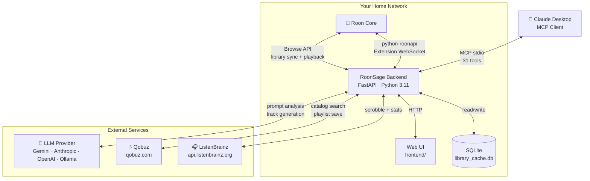
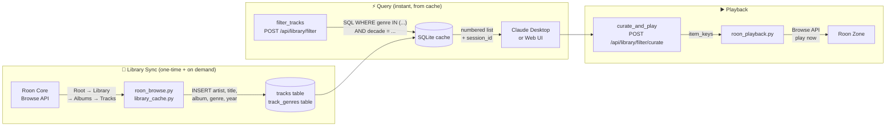
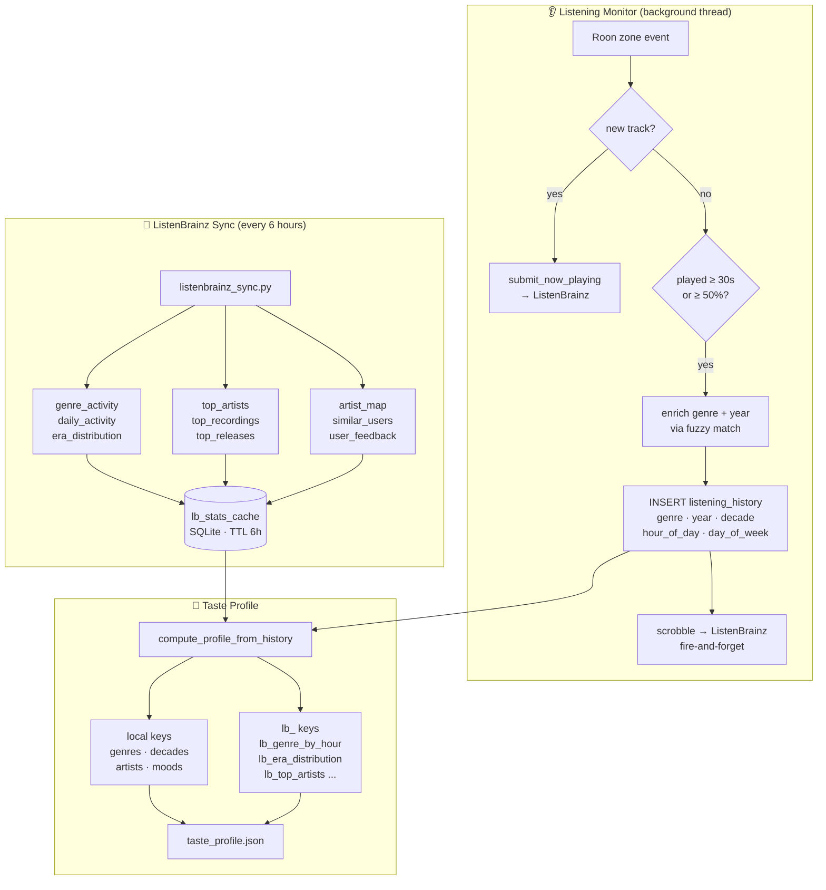
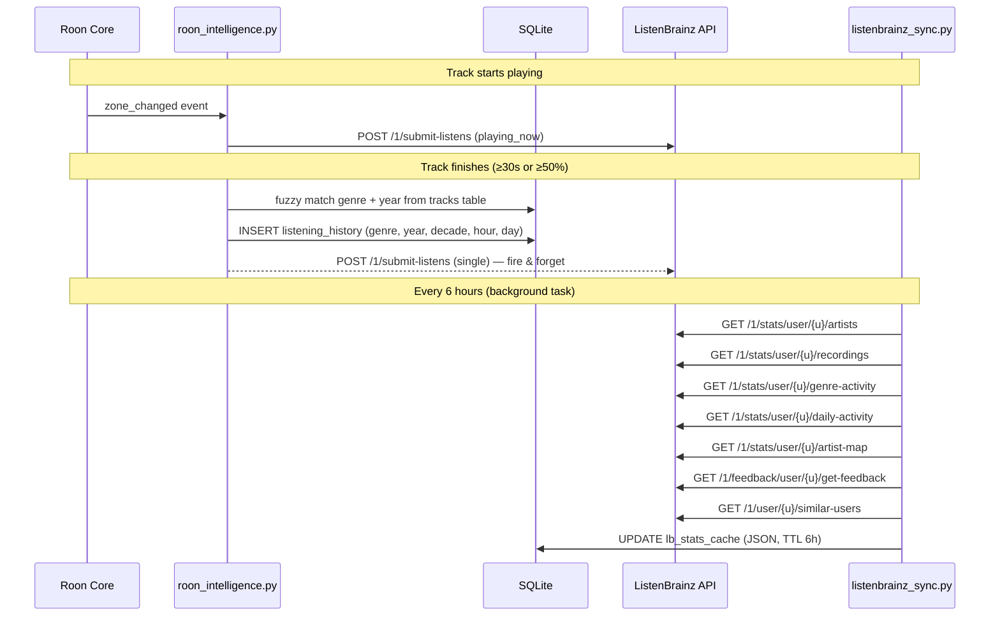

# RoonSage

[](https://opensource.org/licenses/MIT)
[](https://www.python.org/downloads/)
[](#changelog)

AI-powered playlist curation, album recommendations, and music intelligence for Roon — using music you own, music on Qobuz, or both. Now with full **ListenBrainz** integration for two-way sync, scrobbling, and an enriched taste profile.

---

## System Architecture



---

## How It Works — Data Flow



---

## Claude Desktop Integration

This is the primary way to use RoonSage. A full MCP server gives Claude Desktop **31 tools** to interact with your library and Roon — and Claude does all the curation work itself, using its own musical judgment. No extra API key, no per-token costs for curation — just your existing Claude Pro subscription.

```
"Make a playlist for a late Friday evening, something melancholic but not depressing."
"More like what's playing now, but a bit more energetic."
"Find a jazz album I don't know yet and play it."
"Give me everything by Nick Cave that I own."
"Turn on shuffle and set volume to 40%."
"Group the living room and kitchen."
"Save this playlist to Qobuz so I can listen on the go in Arc."
"What's new on Qobuz this week in jazz?"
"What does my taste profile look like right now?"
"I hated that last one — note that in my profile."
"Sync my ListenBrainz stats."
```

### How Claude curates

Claude handles **all** playlist, seed, and recommendation flows itself. The backend provides data and Roon connectivity; Claude does the thinking.

**Three flows:**

| Flow | What the user says | How Claude handles it |
|------|--------------------|-----------------------|
| **Prompt playlist** | "Make a playlist of mellow 90s electronic" | `get_library_stats` → `filter_tracks(compact)` → curate → `curate_and_play` |
| **Seed playlist** | "More like Portishead – Glory Box" | `search_library` → analysis → `filter_tracks(compact)` → curate → `curate_and_play` |
| **Album recommendation** | "Recommend me an album for Sunday morning" | `filter_tracks` or `get_artist_albums` → pick → editorial pitch → `play_album` |

**Three source modes — Claude detects or asks:**

| Source | When | Approach |
|--------|------|----------|
| **Library** | "from my collection", "what I own" | `filter_tracks(compact)` → curate → `curate_and_play` |
| **Hybrid** | "mix of mine + new discoveries" | `filter_tracks(compact)` + `search_qobuz` → blend → `play_tracks` |
| **Qobuz** | "something new", "surprise me" | multiple `search_qobuz` calls → curate → `play_tracks` |

### MCP Tool List (31 tools)

| Tool | Purpose |
|------|---------|
| `get_library_stats` | Genre/decade/total stats from cache |
| `get_library_status` | Cache freshness, needs_resync flag |
| `search_library` | Search by track/artist/album name |
| `search_qobuz` | Search Qobuz catalog via Roon |
| `filter_tracks` | Filter by genre, decade, live exclusion; `output_format` = json/compact/ultra |
| `get_artist_albums` | All albums by artist from SQLite cache |
| `sync_library` | Trigger background library sync |
| `generate_playlist` | AI playlist from natural language (web UI flow / fallback) |
| `seed_track_playlist` | "More like this" playlist from seed track (web UI flow / fallback) |
| `analyze_prompt` | Preview prompt → filter mapping |
| `recommend_album` | Quick album recommendation |
| `recommend_album_interactive` | 2-step Q&A album recommendation |
| `play_album` | Search + play album in one step |
| `list_zones` | List active Roon zones |
| `get_now_playing` | Current playback state per zone |
| `play_tracks` | Send tracks to zone (replaces queue) |
| `queue_tracks` | Append tracks to zone queue |
| `transport_control` | play/pause/stop/next/previous/shuffle/repeat/seek |
| `volume_control` | Set/adjust/get/mute volume by zone name |
| `transfer_zone` | Transfer playback between zones |
| `zone_grouping` | Group/ungroup/list zone groups |
| `play_radio` | Play internet radio station (fuzzy match) |
| `browse_playlists` | List/play Roon playlists |
| `curate_and_play` | Play Claude-curated selection using session_id + track numbers |
| `validate_playlist` | Check selection for duplicates, clustering, overrepresentation |
| `save_to_qobuz` | Save curated playlist to Qobuz account |
| `get_taste_profile` | Full taste profile incl. all ListenBrainz data *(v6.0 updated)* |
| `get_listening_stats` | Combined local + ListenBrainz listening statistics *(v6.0)* |
| `get_listenbrainz_recommendations` | LB "created for you" playlists *(v6.0)* |
| `submit_listen_feedback` | Submit love/hate feedback to ListenBrainz *(v6.0)* |
| `sync_listenbrainz` | Manually trigger ListenBrainz stats sync *(v6.0)* |

### Setup

The MCP server runs locally — not in Docker. RoonSage itself must already be running before Claude Desktop connects.

```bash
# 1. Install the MCP dependency (once per machine)
pip3 install "mcp[cli]"

# 2. Run the install script — it writes the Claude Desktop config automatically
python3 scripts/install_mcp.py

# 3. Restart Claude Desktop
```

Verify in Claude Desktop: **Settings → Developer → MCP Servers** — you should see `roonsage` listed as active.

---

## Intelligence Layer — Taste Profile & History



### What is tracked automatically

- Every track you finish is logged with artist, title, album, genre (fuzzy-matched from library cache), year, decade, hour of day, and day of week.
- A scrobble is sent to ListenBrainz when the track qualifies (≥ 30 s or ≥ 50% of duration).
- Every 6 hours, ListenBrainz stats are pulled and cached locally — genre heatmaps, era distribution, top artists, artist countries, loved/hated recordings, similar users.
- After each playlist session, Claude can update your taste profile using a weighted merge with 30% recency bias.
- Explicit feedback ("I hated that one", "add jazz to my dislikes") is applied immediately.

### Taste profile structure

```json
{
  "genres":   { "Jazz": 0.8, "Electronic": 0.6 },
  "decades":  { "1990s": 0.7, "2000s": 0.5 },
  "artists":  { "Radiohead": 0.9, "Miles Davis": 0.85 },
  "moods":    { "melancholic": 0.7, "energetic": 0.4 },
  "dislikes": ["christmas", "karaoke"],
  "notes":    ["prefers album-oriented listening", "no live versions"],
  "stats":    { "total_playlists": 42, "avg_rating": 4.2 },

  "lb_genre_by_hour":    { "Jazz": [0,0,0,0,0,0,2,5,8,12,8,6,4,3,5,7,9,11,8,5,3,2,1,0] },
  "lb_era_distribution": { "1960s": 12, "1990s": 87, "2010s": 44 },
  "lb_daily_heatmap":    { "Monday": [0,0,0,0,0,1,3,8,12,10,7,5,4,6,8,9,11,8,5,3,2,1,0,0] },
  "lb_top_artists":      [{ "artist_name": "Miles Davis", "listen_count": 312 }],
  "lb_top_recordings":   [{ "track_name": "Kind of Blue", "listen_count": 47 }],
  "lb_artist_countries": [{ "country": "US", "listen_count": 2100 }],
  "lb_loved_recordings": ["msid-abc123", "msid-def456"],
  "lb_hated_recordings": [],
  "lb_similar_users":    [{ "user_name": "jazzfan99", "similarity": 0.87 }]
}
```

Keys prefixed `lb_` come directly from ListenBrainz and are refreshed every 6 hours. All other keys are computed locally from listening history.

---

## ListenBrainz Integration (v6.0)



### Setup

1. Get your token at [listenbrainz.org/profile/](https://listenbrainz.org/profile/) → **User token**
2. Add to your environment (or via **Settings → ListenBrainz** in the web UI):

```bash
LISTENBRAINZ_TOKEN=your-token-here
LISTENBRAINZ_USERNAME=your-username
```

3. Restart RoonSage. The status indicator in **Settings → ListenBrainz** confirms the connection.

ListenBrainz is fully optional. If no token is configured, all scrobbling and stats features are silently skipped and everything works as before.

---

## Features

### Web UI

A dark-themed single-page app for playlist generation and configuration.

- **Generate** — describe a playlist in natural language; the LLM selects from your library.
- **Filter** — narrow by genre, decade, and exclude live recordings before generation.
- **My Taste** — genre breakdown, era heatmap, top artists, loved tracks (v6.0), ListenBrainz stats, 7×24 listening heatmap.
- **Settings** — configure Roon, LLM provider, Qobuz, and ListenBrainz credentials.

### Qobuz Integration

- **Hybrid playlists** — mix library tracks with Qobuz catalog discoveries in one playlist.
- **Discovery mode** — recommend and play albums you don't own from the Qobuz catalog.
- **Playlist save** — save any curated playlist directly to your Qobuz account. Play via Roon ARC.
- **New releases** — browse new and featured Qobuz albums, optionally filtered by genre.
- **Favorites** — add tracks, albums, or artists to your Qobuz favorites from Claude Desktop.

### Supported LLM Providers

| Provider | Analysis model | Generation model | Max tracks to AI |
|----------|---------------|-----------------|-----------------|
| **Gemini** *(recommended)* | `gemini-2.5-flash` | `gemini-2.5-flash` | ~18,000 |
| **Anthropic** | `claude-sonnet-4-5` | `claude-haiku-4-5` | ~3,500 |
| **OpenAI** | `gpt-4.1` | `gpt-4.1-mini` | ~2,300 |
| **Ollama** *(local)* | any installed model | any installed model | depends on context |
| **Custom** *(OpenAI-compatible)* | configured | configured | configured |

Gemini's 1 M token context window allows sending far more of your library to the model, improving variety with large collections.

---

## Deployment

### Docker (recommended)

```bash
git clone https://github.com/Georgemvp/roonsage.git
cd roonsage
cp config.example.yaml config.yaml   # edit with your Roon host + API key
docker-compose up -d
```

Open `http://localhost:5765` — the onboarding wizard guides the first-run setup.

### Bare metal

```bash
python -m venv venv && source venv/bin/activate
pip install -r requirements.txt
export ROON_HOST=192.168.1.x ROON_PORT=9330 GEMINI_API_KEY=your-key
uvicorn backend.main:app --reload --port 5765
```

<details>
<summary><strong>systemd service</strong></summary>

```ini
[Unit]
Description=RoonSage
After=network.target

[Service]
WorkingDirectory=/opt/roonsage
EnvironmentFile=/opt/roonsage/.env
ExecStart=/opt/roonsage/venv/bin/uvicorn backend.main:app --host 0.0.0.0 --port 5765
Restart=on-failure

[Install]
WantedBy=multi-user.target
```

```bash
sudo systemctl enable roonsage && sudo systemctl start roonsage
```
</details>

---

## Configuration

### Environment variables

| Variable | Required | Default | Description |
|----------|----------|---------|-------------|
| `ROON_HOST` | Yes | — | IP or hostname of your Roon Core |
| `ROON_PORT` | No | `9330` | Roon Core port |
| `ROON_CORE_ID` | No | auto | Saved after first authorisation |
| `ROON_TOKEN` | No | auto | Saved after first authorisation |
| `GEMINI_API_KEY` | One of: | — | Google Gemini API key (has free tier) |
| `ANTHROPIC_API_KEY` | One of: | — | Anthropic Claude API key |
| `OPENAI_API_KEY` | One of: | — | OpenAI GPT API key |
| `LLM_PROVIDER` | No | auto-detect | Force: `gemini`, `anthropic`, `openai`, `ollama`, `custom` |
| `OLLAMA_URL` | No | `http://localhost:11434` | Ollama server URL |
| `CUSTOM_LLM_URL` | No | — | OpenAI-compatible API base URL |
| `CUSTOM_CONTEXT_WINDOW` | No | `32768` | Context window for custom provider |
| `ROONSAGE_PASSWORD` | No | — | Enable HTTP Basic Auth on all endpoints |
| `ROONSAGE_URL` | No | `http://localhost:5765` | URL for the MCP server to reach RoonSage |
| `QOBUZ_EMAIL` | No | — | Qobuz account email (for playlist save) |
| `QOBUZ_PASSWORD` | No | — | Qobuz account password (for playlist save) |
| `LISTENBRAINZ_TOKEN` | No | — | ListenBrainz user token *(v6.0)* |
| `LISTENBRAINZ_USERNAME` | No | — | ListenBrainz username *(v6.0)* |

Settings can also be adjusted via the **Settings** page in the web UI. UI-saved settings go to `data/config.user.yaml`. Environment variables always take precedence.

### config.yaml

```yaml
roon:
  host: "192.168.1.x"
  port: 9330

llm:
  provider: "gemini"
  model_analysis: "gemini-2.5-flash"
  model_generation: "gemini-2.5-flash"
  smart_generation: false   # true = use analysis model for both (~3–5× cost, higher quality)

defaults:
  track_count: 25

# Optional — can also be set in Settings UI
listenbrainz:
  token: ""
  username: ""
```

---

## Project Structure

```
backend/
├── main.py                  # FastAPI app, lifespan, router registration
├── dependencies.py          # Shared helpers, auth, rate limiting
├── config.py                # Config loading (env + YAML)
├── db.py                    # SQLite schema init + migrations
├── models.py                # Pydantic request/response models
├── library_cache.py         # Library read/write against SQLite
├── roon_client.py           # Roon Extension connection manager
├── roon_intelligence.py     # Listening monitor, scrobbling, enrichment
├── roon_browse.py           # Browse API traversal (library sync)
├── roon_playback.py         # Track playback via Browse API
├── taste_profile.py         # Taste profile compute + merge
├── listenbrainz_client.py   # ← v6.0  ListenBrainz async API client
├── listenbrainz_sync.py     # ← v6.0  Stats sync service (6h TTL cache)
├── llm_client.py            # LLM provider abstraction layer
├── analyzer.py              # Prompt → filter dimension extraction
├── generator.py             # Track list → LLM selection
├── recommender.py           # Album recommendation pipeline
├── qobuz_browser.py         # Qobuz search via Roon Browse API
├── qobuz_api.py             # Direct Qobuz API (playlist save)
└── routes/
    ├── library.py           # Library cache, filter, curate endpoints
    ├── generate.py          # Playlist generation + analysis
    ├── recommend.py         # Album recommendation
    ├── intelligence.py      # Taste profile, listening history, LB endpoints
    ├── roon.py              # Zones, queue, transport, art proxy
    ├── config_routes.py     # Config, health, Ollama
    ├── results.py           # Result history
    ├── qobuz_playlist.py    # Qobuz playlist save
    └── setup.py             # Onboarding + validation endpoints

frontend/
├── index.html               # Single-page app
├── style.css                # Dark theme (amber accent)
└── modules/
    ├── app.js               # App bootstrap, routing
    ├── playlist.js          # Playlist generation + settings
    ├── taste.js             # My Taste view + ListenBrainz charts
    └── events.js            # Global event handlers

mcp_server.py                # MCP server (FastMCP, stdio transport)
scripts/install_mcp.py       # One-click Claude Desktop MCP config
data/
└── library_cache.db         # SQLite (tracks, listening_history, lb_stats_cache, ...)
```

---

## API Reference

Interactive Swagger docs at `/docs` when the server is running.

### Library

| Endpoint | Method | Description |
|----------|--------|-------------|
| `/api/library/stats/cached` | GET | Genre/decade/total counts from SQLite |
| `/api/library/status` | GET | Cache status, track count, needs_resync flag |
| `/api/library/sync` | POST | Trigger background library sync |
| `/api/library/search` | GET | Search by track/artist/album name |
| `/api/library/artist-albums` | GET | All albums by an artist from cache |
| `/api/library/filter` | POST | Filter by genre, decade, live exclusion |
| `/api/library/filter/curate` | POST | Translate session track numbers → item_keys → play |
| `/api/library/filter/validate` | POST | Check selection for duplicates and clustering |

### Generation & Recommendations

| Endpoint | Method | Description |
|----------|--------|-------------|
| `/api/analyze/prompt` | POST | Analyse prompt → filter mapping preview |
| `/api/generate/stream` | POST | Stream playlist generation (SSE) |
| `/api/recommend/questions` | POST | Generate clarifying questions for album recommendation |
| `/api/recommend/generate` | POST | Generate album recommendations |

### Roon Playback & Control

| Endpoint | Method | Description |
|----------|--------|-------------|
| `/api/roon/zones` | GET | Active zones + playback state |
| `/api/queue` | POST | Send tracks to a zone (replace queue) |
| `/api/queue/append` | POST | Append tracks to zone queue |
| `/api/roon/transport` | POST | play/pause/stop/next/previous/shuffle/repeat/seek |
| `/api/roon/volume` | POST | Set/adjust/mute/query volume |
| `/api/roon/transfer` | POST | Move playback to another zone |
| `/api/roon/group` | POST | Group or ungroup zones |
| `/api/roon/radio` | POST | Play internet radio station |
| `/api/roon/playlists` | POST | List or play Roon playlists |
| `/api/roon/qobuz-search` | POST | Search Qobuz catalogue via Roon |
| `/api/art/{item_key}` | GET | Proxy album art from Roon |

### Intelligence & Taste

| Endpoint | Method | Description |
|----------|--------|-------------|
| `/api/intelligence/taste-profile` | GET | Retrieve taste profile |
| `/api/intelligence/taste-profile` | PUT | Merge updates into taste profile |
| `/api/intelligence/taste-profile/detailed` | GET | Full profile incl. ListenBrainz data *(v6.0)* |
| `/api/intelligence/listening-history` | GET | Paginated listening history |
| `/api/intelligence/listening-history/recompute` | POST | Recompute taste profile from history |
| `/api/intelligence/listening-history/enrich` | POST | Backfill genre/year/decade on existing rows *(v6.0)* |
| `/api/intelligence/listening-stats` | GET | Combined local + ListenBrainz stats *(v6.0)* |
| `/api/intelligence/listenbrainz/sync` | POST | Manually trigger ListenBrainz stats sync *(v6.0)* |
| `/api/intelligence/listenbrainz/status` | GET | LB config status, scrobble count, last sync *(v6.0)* |
| `/api/intelligence/listenbrainz/recommendations` | GET | LB "created for you" playlists *(v6.0)* |
| `/api/intelligence/taste-events` | GET | Recent taste events (plays, ratings, feedback) |

### Qobuz

| Endpoint | Method | Description |
|----------|--------|-------------|
| `/api/qobuz/playlist/save` | POST | Save playlist to Qobuz account |
| `/api/qobuz/save-status` | GET | Check whether Qobuz save is configured |
| `/api/qobuz/validate` | POST | Validate Qobuz credentials |
| `/api/qobuz/favorite/add` | POST | Add to Qobuz favorites |
| `/api/qobuz/favorite/remove` | POST | Remove from Qobuz favorites |
| `/api/qobuz/favorites` | GET | List Qobuz favorites |
| `/api/qobuz/playlists` | GET | List Qobuz playlists |
| `/api/qobuz/playlist/{id}` | GET/PUT/DELETE | Get, update, or delete a Qobuz playlist |
| `/api/qobuz/new-releases` | GET | Browse new/featured Qobuz albums |
| `/api/qobuz/prepare-for-arc` | POST | Resolve tracks → Qobuz playlist → favorites (ARC workflow) |

### Saved Playlists

| Endpoint | Method | Description |
|----------|--------|-------------|
| `/api/playlists/saved` | GET | List all saved playlists |
| `/api/playlists/saved` | POST | Save a new playlist by name |
| `/api/playlists/saved/{id}` | GET/PUT/DELETE | Retrieve, update, or delete |
| `/api/playlists/saved/{id}/play` | POST | Play a saved playlist in a zone |

### Config & Health

| Endpoint | Method | Description |
|----------|--------|-------------|
| `/api/health` | GET | Health check (Roon, LLM, DB) |
| `/api/config` | GET/POST | Retrieve or update configuration |
| `/api/setup/status` | GET | Onboarding checklist |
| `/api/setup/validate-roon` | POST | Validate Roon Core connection |
| `/api/setup/validate-ai` | POST | Validate AI provider credentials |
| `/api/setup/validate-listenbrainz` | POST | Validate ListenBrainz token *(v6.0)* |

---

## Development

```bash
git clone https://github.com/Georgemvp/roonsage.git
cd roonsage
python -m venv venv && source venv/bin/activate
pip install -r requirements.txt
export ROON_HOST=192.168.1.x ROON_PORT=9330 GEMINI_API_KEY=your-key
uvicorn backend.main:app --reload --port 5765
```

```bash
pytest tests/ -v    # run tests
ruff check .        # linting
```

**Stack:** Python 3.11+, FastAPI, python-roonapi, anthropic / openai / google-genai SDKs, httpx, rapidfuzz, SQLite, vanilla HTML/CSS/JS, FastMCP.

---

## Security

RoonSage is designed for home network use. Without `ROONSAGE_PASSWORD`, anyone on your network has access to the web UI.

`ROONSAGE_PASSWORD` enables HTTP Basic Auth on all endpoints. The health check (`/api/health`) and the art proxy are exempt so Docker health checks and album art work without credentials.

LLM-powered endpoints are rate-limited to 30 requests per hour per IP. API keys are stored in `data/config.user.yaml` (permissions 600) and are never exposed via the API.

---

## Changelog

### v6.0 — ListenBrain + ListenBrainz (2026-05-19)
- **Scrobbling** — every completed listen is sent to ListenBrainz automatically.
- **Now Playing** — "playing now" notifications sent on every track start.
- **Stats sync** — genre heatmap, era distribution, daily activity, artist map, top artists/recordings/releases, similar users, and loved/hated recordings pulled every 6 hours and cached in SQLite.
- **Enriched listening history** — genre, year, decade, hour of day, and day of week stored per listen; fuzzy-matched from library cache.
- **Enriched taste profile** — all ListenBrainz data available as `lb_*` keys alongside local profile keys.
- **4 new MCP tools** — `get_listening_stats`, `get_listenbrainz_recommendations`, `submit_listen_feedback`, `sync_listenbrainz`.
- **6 new API endpoints** — detailed taste profile, LB status, manual sync, recommendations, history enrich, validate token.
- **My Taste view** — LB status card, genre and era bar charts, 7×24 listening heatmap, LB top artists, loved tracks.
- **Settings** — ListenBrainz token + username fields with validate button.

### v4.9 — Qobuz global-search fix (2026-05-19)
Synthetic key (`qobuz_search::artist::title`) for tracks found via Roon's global search fallback — fixes playback of Qobuz tracks after session state changes.

### v4.4–v4.8 — Qobuz & reliability (2026-05-15–16)
Qobuz playlist save, direct Qobuz API client with auto-detected app_id, ARC workflow, global-search fallback, curate_and_play timeout fixes, and classical track search improvements.

### v4.2–v4.3 — Claude-native curation (2026-05-15)
`filter_tracks` compact/ultra output formats, server-side session key storage, `curate_and_play` tool, `validate_playlist` tool — Claude now curates playlists natively without backend LLM calls.

### v4.0 — Qobuz + time-aware context (2026-05-15)
Qobuz integration via Roon Browse API, hybrid/qobuz source modes, time-of-day playlist context, MCP server refactor.

### v3.0 — MCP server (2026-05-15)
Initial MCP server for Claude Desktop: `generate_playlist`, `recommend_album`, transport control, zone grouping, volume control.

---

## Credits

RoonSage is based on [MediaSage](https://github.com/ecwilsonaz/mediasage) by Eric Wilson, originally built for Plex. RoonSage has been independently developed for Roon with significant new functionality: MCP integration, Qobuz support, zone management, ListenBrainz sync, time-aware context, and a full library cache layer.

---

## License

MIT
